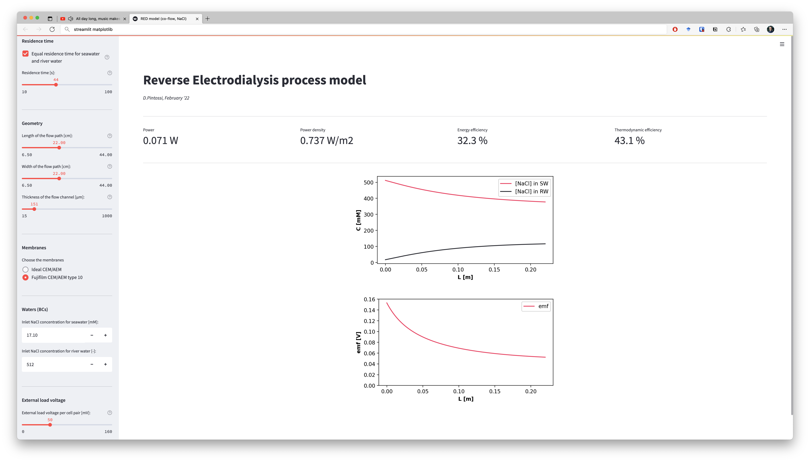

# RED-model-with-GUI

Reverse electrodialysis (RED) process model based on Veerman et al. (2011) and Simões et al. (2020) with a Streamlit-based GUI.

The web app is hosted on Streamlit Cloud: https://share.streamlit.io/diegopintossi/red-model-streamlit-app/main/main.py.



___
Requirements (to run it locally):
- `streamlit`, used to create the web app (requires a Python 64-bit to run)
- `numpy`, used to obtain the discretized domain for the ODEs numerical solution
- `matplotlib`, used to generate the plots
- `scipy`, used to numerically solve the system of ODEs (with `scipy.integrate.odeint`)

To install the requirements:
```
pip install -r requirements.txt
```
